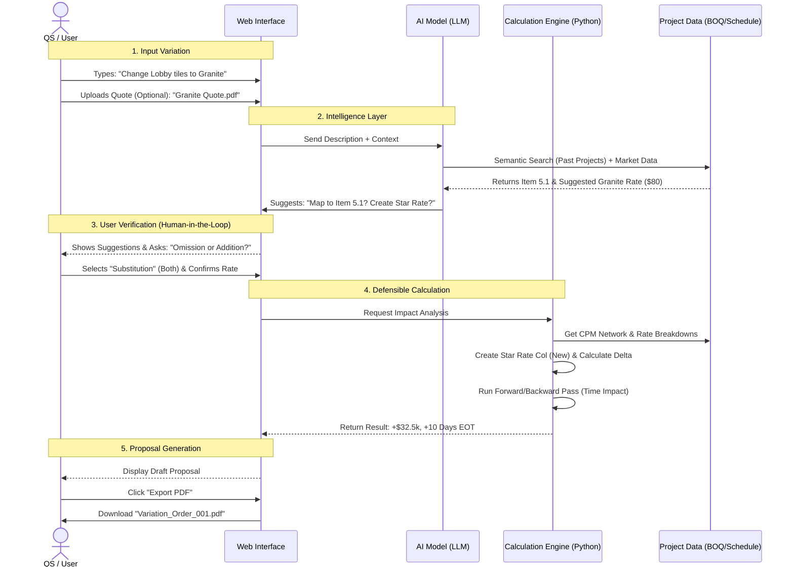

# User Flow & Example Scenario

## 1. Concrete Scenario: "Lobby Flooring Change"

**Context**:

- **Project**: High-rise Commercial Building.
- **Current Status**: Superstructure complete, internal finishes starting next month.
- **Original Scope**: 500 m² of _Ceramic Tiles_ in the Main Entrance Lobby.
- **Variation Request**: Client wants to upgrade to _Granite Slabs_ for a premium look.

### Input Data

- **Original BOQ Item**: `Item 5.1: Supply and lay 600x600 Ceramic Tiles - $40/m²`.
- **Rate Breakdown (Ceramic)**: Material ($25), Labor ($10), Plant ($2), Overheads ($3).
- **Schedule**: Activity `ID-105: Lobby Flooring` (Duration: 10 days, 50m²/day). Starts: Day 100.
- **Variation Description (User Input)**: "Change Main Lobby flooring from Ceramic to Granite. Thickness 20mm."

---

## 2. System Processing (Hybrid Approach)

### Step A: AI Parsing & Mapping (The "Understanding" Layer)

The AI analyzes the text input:

1.  **Identifies Scope**: "Change" means _Omission_ of old item + _Addition_ of new item.
2.  **Productivity search**: AI suggests Granite laying is slower than Ceramic (e.g., 25m²/day vs 50m²/day).
3.  **Material search**: AI suggests price using **Market Data** or **Past Project History** (Semantic Search) - e.g., finding "Granite" in a previous project or price book.

### Step A-2: User Interaction (UI)

- **Mode Selection**: The UI presents the AI's findings and asks the user to select the **Variation Mode**:
  - **[Omission]** (Remove item only)
  - **[Addition]** (Add new item only)
  - **[Substitution]** (Remove old + Add new - _Selected for this scenario_)

### Step B: Deterministic Calculation (The "Math" Layer)

The Python Engine executes:

1.  **Cost Calculation (Omission)**:
    - `500m² * $40 = -$20,000` (Credit)
2.  **Cost Calculation (Addition)**:
    - **Star Rate creation**: The system duplicates the "Ceramic" analysis to a **New Variation Column**.
    - **Adjustment**: Replaces "Ceramic" with "Granite" ($80) and adjusts "Labor" ($15) for lower productivity.
    - **Result**: New Rate = $105/m². Original Rate ($40) is preserved in the adjacent column.
    * `500m² * $105 = +$52,500`
    * **Net Cost Impact**: `+$32,500`.
3.  **Time Calculation (CPM)**:
    - Original Duration: `500m² / 50 = 10 days`.
    - New Duration: `500m² / 25 = 20 days`.
    - Delay: `+10 days`.
    - **Critical Path Check**: If `ID-105` is on the Critical Path, Project EOT = 10 Days. If it has 15 days Float, EOT = 0 Days.

---

## 3. User Flow Diagram

## 4. Why This Flow?

- **Speed**: User doesn't type lines of calculations. They just type the "Intent".
- **Control**: The User _confirms_ the AI's suggestions (Step 3) before math happens. This prevents "Hallucinations" from entering the contract.
- **Accuracy**: The final numbers come from the `ENG` (Math Engine), not the `AI`.
